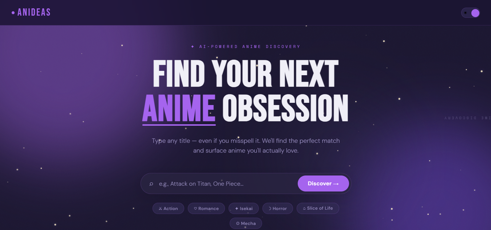

# Anideas — Anime Discovery Platform

**Find Your Next Anime Obsession.**  
Type any title — even misspelled, abbreviated, or in Japanese — and Anideas instantly guides you to the correct show, then recommends similar anime from a pre‑clustered dataset of 21,945 titles.

 <!-- optional: add a screenshot -->

---

## 📖 Table of Contents

- [Overview](#-overview)
- [Features](#-features)
- [Tech Stack](#-tech-stack)
- [Data Pipeline & Schema](#-data-pipeline--schema)
- [Project Structure](#-project-structure)
- [Getting Started](#-getting-started)
- [Environment Variables](#-environment-variables)
- [Team](#-team)
- [Acknowledgments](#-acknowledgments)
- [License](#-license)

---

## 🧭 Overview

Anideas is a full‑stack web application that solves the post‑anime void: you finish a series and want something similar, but don’t know where to start. It combines **semantic search**, a **local LLM matcher**, and **unsupervised clustering** to deliver fast, relevant recommendations, all wrapped in a polished space‑themed interface.

The system runs on a **static, pre‑enriched dataset** — no live API calls at recommendation time except the optional local LLM. This makes it fast, privacy‑friendly, and deployable anywhere.

---

## ✨ Features

### 🔍 Intelligent Search
- **Ghost‑text autocomplete** – suggestions appear inline as you type, navigable with Tab / Arrow keys.
- **Hybrid matching** – combines a lightning‑fast prefix index with semantic embeddings (`all-MiniLM-L6-v2`) for fuzzy or abbreviated queries.
- **LLM fallback** – a local Ollama model (`llama3.2:1b`) corrects severe misspellings and unusual transliterations (e.g. “Shingeki no Kyojin” → “Attack on Titan”).
- **Misspell cache** – once a correction is learned, it’s saved to disk and becomes instant.

### 🧠 Content‑Based Recommendations
- **K‑Means clustering** – anime are grouped into 148 thematic clusters based on genres, themes, demographics, synopsis embeddings, and production metadata.
- **Cosine similarity ranking** – within the matched title’s cluster, every candidate is scored and ranked.
- **Color‑coded confidence badges** – green (≥80%), orange (≥60%), grey (<60%).
- **Pagination** – browse results 20 at a time.

### 📄 Rich Detail Page
- Full metadata: poster, title, rating, year, episode count, studio, source, synopsis.
- Genre / theme pills.
- **“Watch” dropdown** – deep links to Crunchyroll, AniList, MyAnimeList, and Google search.

### 🎨 Frontend & UX
- **Dark / light theme** with persistent preference (`localStorage`).
- **Live starfield canvas** – twinkling stars (dark) or drifting dust (light) animated via JavaScript.
- **Glass‑morphism navbar**, hovering cards, staggered entrance animations.
- **Responsive** – works on mobile, tablet, and desktop.

### ⚙️ Performance & Robustness
- In‑memory caches for autocomplete (5‑min TTL) and title embeddings.
- Graceful fallbacks: “Unknown” placeholders for missing years, synopsis stubs, and cover images.
- Fully documented data schema with clear sentinels for missing data.

---

## 🧰 Tech Stack

| Layer | Technology |
|-------|------------|
| **Backend** | Python 3.10+, Flask |
| **Data Processing** | Pandas, NumPy, scikit‑learn |
| **Clustering** | K‑Means (scikit‑learn) |
| **Embeddings** | Sentence‑Transformers (`all-MiniLM-L6-v2`), HuggingFace |
| **Local LLM** | Ollama (`llama3.2:1b`) |
| **Sentiment Analysis** | VADER (NLTK) |
| **Frontend** | HTML5, CSS3, vanilla JavaScript, Jinja2 templates |
| **Data Enrichment** | Jikan API (MyAnimeList), AniList GraphQL API |

---

## 📊 Data Pipeline & Schema

### Source & Enrichment
- **Base dataset**: Kaggle “MyAnimeList – Anime and Manga Lists” (~21,945 entries).
- **Enrichment**: Missing synopses, English / Japanese titles, cover images, studios, and ratings were fetched via the **Jikan API** and **AniList**.
- **Adult content**: All titles with Hentai, Erotica, or Ecchi genres, as well as un‑tagged R+ entries, were removed to a separate `anime_adult.csv` file.
- **Noise removal**: Promotional videos (`type == "PV"`), cluster‑0 noise, and stale “Currently Airing” entries were excluded.

### Final Dataset Columns (`anime_clean.csv`)
- `anime_id`, `title`, `english_title`, `japanese_title`, `synopsis`, `synopsis_stub`
- `type`, `source`, `episodes`, `episodes_is_imputed`, `status`, `duration`
- `rating`, `year`, `year_is_imputed`, `genres`, `themes`, `demographics`, `studios`
- `image_url`, `cluster_id`

### Feature Matrix (`anime_features_scaled.csv`)
- **Genres (21)**, **Themes (52)**, **Demographics (5)** – binary one‑hot.
- **Type, Source, Rating, Duration Bucket, Decade** – one‑hot with clean column names.
- **Studios** – Top‑50 most frequent studios + “Other”; each row **L2‑normalised** so multi‑studio productions don’t dominate.
- **Year** – scaled `[0,1]` for non‑imputed rows; imputed rows receive neutral `0.5` + a `year_is_imputed` flag.
- **Episodes** – `log1p` transform, then scaled `[0,1]`; imputed rows get the mean of non‑imputed values + `episodes_is_imputed` flag.
- **Synopsis Embeddings** – 384‑dim vectors from `all-MiniLM-L6-v2` reduced to **50 PCA components**; stub synopses replaced with zero vectors.
- **Synopsis Sentiment** – VADER compound score; stub rows use global mean with `sentiment_is_default` flag.
- **Additional**: `num_studios`, `is_finished`, duration bucket, decade.

### Content & Display Policies
- Display `english_title` when available, else fallback to romanised `title`.
- When `synopsis_stub == True`, show “Full synopsis not available”.
- Missing year → “Unknown”; missing rating → “Unrated”.
- Placeholder images → self‑hosted `no_image.png`; theme‑aware fallback for dark/light mode.

---

## 📁 Project Structure

```
anideas/
├── app.py                     # Flask application & all routes
├── templates/
│   ├── index.html             # Homepage with search & ghost autocomplete
│   ├── results.html           # Paginated recommendation cards
│   └── info.html              # Anime detail page
├── static/
│   ├── favicon.ico, *.png     # Favicons & app icons
│   ├── no_image.png           # Fallback poster
│   ├── images/
│   │   ├── dark.png           # Theme‑aware placeholder
│   │   └── light.png
│   └── site.webmanifest
├── data/
│   ├── anime_clean.csv        # Enriched, cleaned catalogue
│   ├── anime_features_scaled.csv  # Feature matrix
│   ├── misspell_cache.json    # Persistent LLM correction cache
│   └── anime_adult.csv        # Quarantined adult content (excluded)
├── title_embeddings.pkl       # Cached title embeddings
├── requirements.txt
├── .env.example
└── README.md
```

---

## 🚀 Getting Started

### Prerequisites
- Python 3.10 or later
- [Ollama](https://ollama.com) (optional; for LLM‑based title matching)

### Installation

```bash
git clone https://github.com/your-org/anideas.git
cd anideas

# Create & activate a virtual environment
python -m venv venv
source venv/bin/activate      # Linux / macOS
venv\Scripts\activate         # Windows

# Install dependencies
pip install -r requirements.txt
```

### Environment Setup
Copy the example environment file and adjust as needed:

```bash
cp .env.example .env
```

### Run the Application

```bash
python app.py
```

The app will start at `http://localhost:5001`. Open it in your browser.

### (Optional) Enable LLM Title Matching
If you have Ollama installed and running:

```bash
ollama pull llama3.2:1b
```

Then set the following in your `.env`:

```
OLLAMA_URL=http://localhost:11434/api/generate
OLLAMA_MODEL=llama3.2:1b
```

If Ollama is not available, the app will gracefully degrade to embedding‑only matching, which still works well for most queries.

---

## ⚙️ Environment Variables

| Variable | Default | Description |
|----------|---------|-------------|
| `PORT` | `5001` | Port for the Flask development server |
| `FLASK_DEBUG` | `false` | Set to `true` for debug mode |
| `OLLAMA_URL` | `http://localhost:11434/api/generate` | Ollama API endpoint |
| `OLLAMA_MODEL` | `llama3.2:1b` | Model name to use for title matching |
| `MISSPELL_CACHE` | `misspell_cache.json` | Path to the misspell cache file |

---

## 👥 Team

| Member | Role |
|--------|------|
| **Gabriel** | Data Preparation – cleaning, enriching, API integrations |
| **Nathan** | Model Readiness – clustering, feature engineering |
| **Ugonna** | Backend – Flask server, autocomplete, LLM matching, caching |
| **Jaivir** | Frontend – UI design, ghost‑text autocomplete, starfield, animations |

---

## 🙏 Acknowledgments

- **Kaggle** for the initial anime dataset.
- **Jikan API** and **AniList** for metadata enrichment.
- **HuggingFace** for the `all-MiniLM-L6-v2` sentence transformer.
- **Ollama** for making local LLM inference simple and fast.
- **VADER** (NLTK) for synopsis sentiment analysis.
- The open‑source communities behind Flask, Pandas, scikit‑learn, and all the other tools we used.

---

## 📄 License

This project is intended for educational purposes. Please respect the data usage policies of MyAnimeList and AniList if you plan to deploy publicly.

---

Anideas — built with curiosity, cleaned with grit, and polished with starlight. ✨